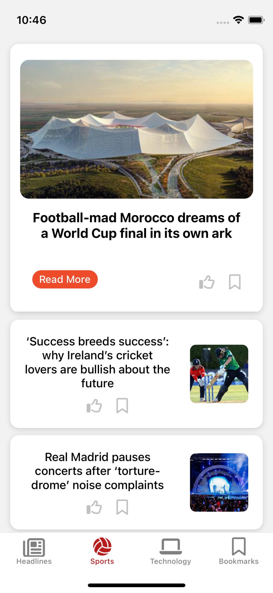
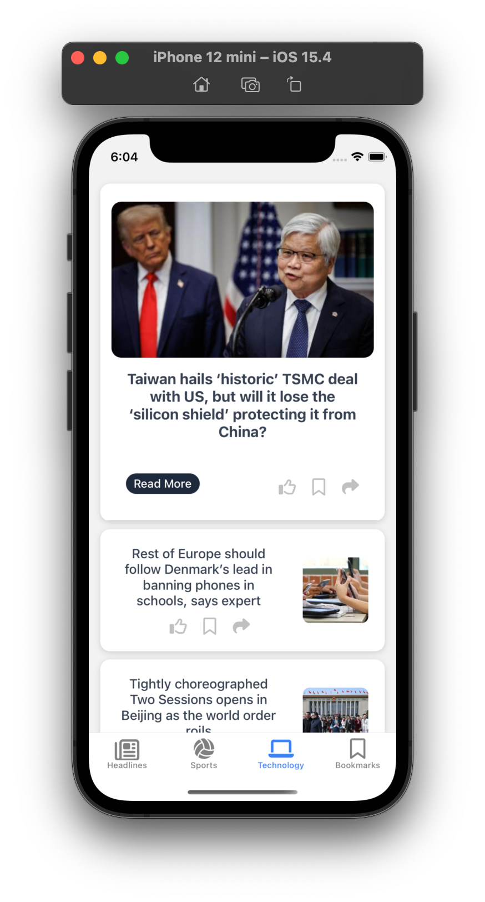
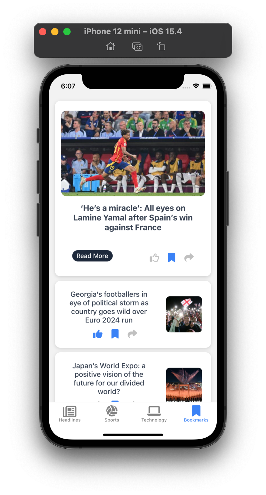

# NewsFlash - A React Native App to view News using The Guardian API

## App Description
- Browse through the latest Headlines
- View Articles in full using the in-App browser
- Bookmark news headlines for offline viewing
- Like those stories that you enjoy
- Works both on Android and iOS

## Features
- Real-time news from the Guardian API
- WebView integration for viewing full Articles in-App
- AsyncStorage for offline bookmarks
- Like or bookmark toggles
- Fully mobile responsive

## Screenshots

  

    
    
<strong>Headlines</strong>

  

  

    
    
<strong>Sports</strong>

  

  

    
    
<strong>Tech</strong>

  

  

    
    
<strong>Bookmarks</strong>

  

## Technologies
- React Native + Expo Router
- TypeScript
- AsyncStorage
- React Native WebView
- Expo Icons (FontAwesome6)

## What I learned
This project introduced helped me master:
- API integration
- Expo Router navigation and routing
- Working with AsyncStorage for persistant data
- Implementing WebView for in-app web browsing

### Getting Started

1. Clone the Repo: 
`git clone https://github.com/mue864/news-mobile`

2. Navigate to project folder: 
`cd news-mobile`

3. Install required dependancies: 
`npm install`

4. Run app: 
`npm start`
